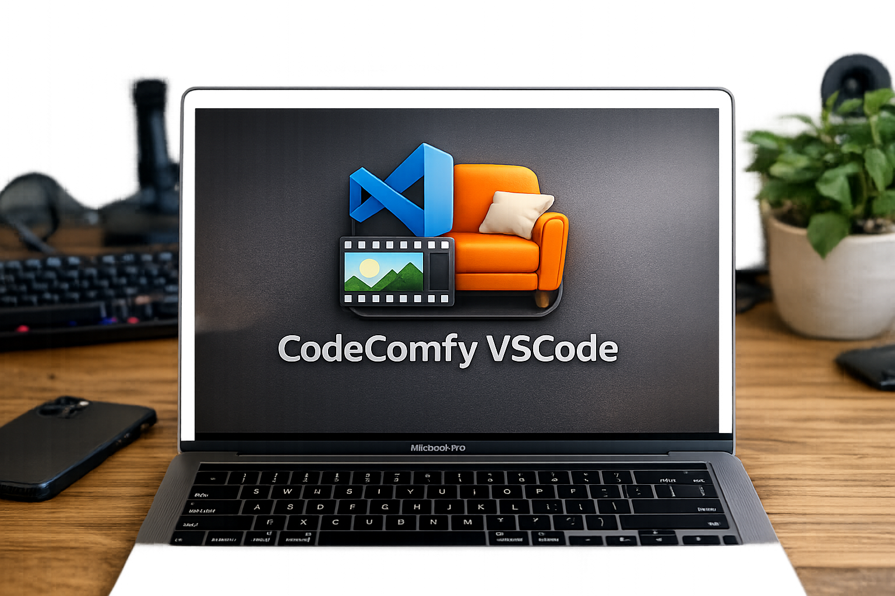

**Languages:** [English](README.md) | [日本語](README.ja.md) | [中文](README.zh.md) | [Español](README.es.md) | [Français](README.fr.md) | [हिंदी](README.hi.md) | [Italiano](README.it.md) | [Português](README.pt-BR.md)

<p align="center">
  
</p>

# CodeComfy — ComfyUI generation from VS Code

[](https://github.com/mcp-tool-shop-org/codecomfy-vscode/actions/workflows/ci.yml)

*Sit back, type a prompt, let the couch do the work.*

Generate images and videos with ComfyUI without leaving your editor.
Pick a preset, type a prompt, and watch the status bar while CodeComfy
handles the workflow submission, polling, frame download, and FFmpeg assembly.

> **Windows-first, cross-platform friendly.** Fully tested on Windows 10/11.
> macOS and Linux are expected to work — see [Known Limitations](#known-limitations).
> PRs welcome.

---

## Prerequisites

| Dependency | Required | Notes |
|------------|----------|-------|
| **ComfyUI** | Yes | Running locally (`http://127.0.0.1:8188`) or on a remote machine. CodeComfy talks to its HTTP API. |
| **FFmpeg**  | For video | Must be on your system PATH *or* configured via `codecomfy.ffmpegPath`. [Download FFmpeg](https://ffmpeg.org/download.html). |
| **NextGallery** | Optional | Companion gallery viewer. Not required for generation itself. |

## Installation

CodeComfy is not yet on the VS Code Marketplace.
Install from a `.vsix` file:

1. Download the latest `.vsix` from
   [Releases](https://github.com/mcp-tool-shop-org/codecomfy-vscode/releases).
2. In VS Code: **Extensions** sidebar → `···` menu → **Install from VSIX…**
3. Reload the window when prompted.

### Settings

Open **Settings → Extensions → CodeComfy** or add to `settings.json`:

```json
{
  "codecomfy.comfyuiUrl": "http://127.0.0.1:8188",
  "codecomfy.ffmpegPath": "",
  "codecomfy.autoOpenGalleryOnComplete": true,
  "codecomfy.nextGalleryPath": "",
  "codecomfy.defaultNegativePrompt": ""
}
```

| Setting | Description | Default |
|---------|-------------|---------|
| `codecomfy.comfyuiUrl` | ComfyUI server URL | `http://127.0.0.1:8188` |
| `codecomfy.ffmpegPath` | Absolute path to FFmpeg executable (leave empty for PATH lookup) | `""` |
| `codecomfy.autoOpenGalleryOnComplete` | Open NextGallery after generation finishes | `true` |
| `codecomfy.nextGalleryPath` | Absolute path to NextGallery.exe | Auto-detect |
| `codecomfy.defaultNegativePrompt` | Default negative prompt pre-filled during generation | `""` |

## Quickstart

1. **Start ComfyUI** — make sure it is running and reachable.
2. **Pick a command** — open the Command Palette (`Ctrl+Shift+P`) and choose:
   - `CodeComfy: Generate Image (HQ)` — single image
   - `CodeComfy: Generate Video (HQ)` — short video (2–8 s)
3. **Enter a prompt**, optionally a **negative prompt** (things to avoid), and a **seed**, then watch the status bar.

<!-- Screenshots: replace with real PNGs — see assets/SCREENSHOTS.md -->

The **status bar** shows real-time progress (queued → generating → done).

Structured logs appear in the **CodeComfy** Output channel
(`Ctrl+Shift+U`, then select "CodeComfy").

Outputs are saved to `.codecomfy/outputs/` in your workspace root.
Run metadata lives in `.codecomfy/runs/`.

### Cancel

Run `CodeComfy: Cancel Generation` from the Command Palette or click the
status bar item while a generation is in progress.

## Generation Limits

Video generation enforces safety limits to prevent accidental resource exhaustion:

| Parameter | Min | Max |
|-----------|-----|-----|
| Duration  | 1 s | 15 s |
| FPS       | 1   | 60   |
| Total frames (duration × fps) | — | 450 |

If you hit a limit, reduce the duration or choose a preset with a lower frame rate.

## Troubleshooting

### `[Network]` — Can't reach ComfyUI server

- Is ComfyUI running? Check `http://127.0.0.1:8188/system_stats` in a browser.
- If ComfyUI is on a different port or host, update `codecomfy.comfyuiUrl`.
- Firewall or proxy blocking the connection? Try `curl http://127.0.0.1:8188/system_stats`.

### `[Server]` — ComfyUI returned an error

- Check the ComfyUI terminal/console for stack traces.
- Common cause: missing model checkpoint or custom node.
- Ensure your ComfyUI has the nodes required by the preset workflow.

### `[API]` — Response shape error

- Your ComfyUI version may be too old or too new for the bundled presets.
- A reverse proxy or CDN may be mangling JSON responses.
- Try hitting `/prompt` and `/history` directly to inspect the response shape.

### `[IO]` — File permission or disk issues

- Ensure your workspace folder is writable.
- Check available disk space — frame downloads can be large for video.
- On Windows, avoid workspaces on network drives for best performance.

### FFmpeg not found

- Install FFmpeg and ensure `ffmpeg.exe` is on your system PATH.
- Or set `codecomfy.ffmpegPath` to the **full absolute path** (e.g. `C:\ffmpeg\bin\ffmpeg.exe`).
- Relative paths and bare names (other than the PATH-resolved `ffmpeg`) are rejected for security.

### "Generation already running"

Only one generation can run at a time.
Cancel the current one (`CodeComfy: Cancel Generation`) or wait for it to finish.
There is a 2-second cooldown between consecutive jobs.

### Seed / prompt validation

- Seeds must be whole numbers between 0 and 2,147,483,647.
- Prompts must be non-empty and at most 8,000 characters.

## Known Limitations

| Area | Status |
|------|--------|
| **Windows** | Fully tested (Windows 10/11). Primary platform. |
| **macOS** | Expected to work for image + video generation. NextGallery may not be available yet. |
| **Linux** | Expected to work for image + video generation. NextGallery may not be available yet. |
| **Remote / WSL** | ComfyUI URL must be reachable from the host running VS Code. |

Core functionality (prompt → ComfyUI → download → FFmpeg assembly) is
platform-agnostic. The only Windows-specific feature is NextGallery
auto-detection, which falls back gracefully to a "set the path in
settings" prompt on other platforms.

If you hit a platform-specific issue, please
[open an issue](https://github.com/mcp-tool-shop-org/codecomfy-vscode/issues)
with your OS, VS Code version, and ComfyUI version.

## How It Works

```
Command Palette
   │
   ▼
extension.ts  ─── validates inputs, creates JobRouter
   │
   ▼
JobRouter     ─── creates run folder, tracks lifecycle
   │
   ▼
ComfyServerEngine ─── POST /prompt → poll /history → stream /view
   │
   ▼
FFmpeg        ─── (video only) assemble frames → MP4
   │
   ▼
.codecomfy/outputs/index.json  ─── atomic index update
```

## License

MIT
