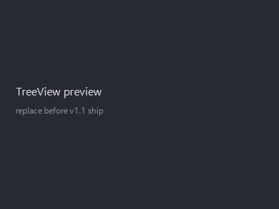

CodeComfy adds a **Run History** tree view to the VS Code activity bar so you can browse, inspect, and re-run past generations without leaving the editor.

## What it is

Click the CodeComfy icon in the activity bar (left side of the VS Code window). The **Run History** view lists every generation that has written to the current workspace, newest first.

## What you see per run

Each row in the tree shows:

- **`run_id`** — the short identifier assigned when the job started (e.g. `m1abc_12345678`).
- **Timestamp** — when the run finished.
- **Status icon** — green check for succeeded, red X for failed, yellow dot for canceled, gray spinner for still running.
- **Preset used** — the preset id the generation ran under (`hq-image`, `hq-video`, or any user-authored preset).

Expand a row to see the artifacts that run produced (images, videos, thumbnails). Clicking an artifact opens it in a VS Code preview tab.

## Re-run a previous generation

Right-click a run in the tree and choose **Re-run Previous Generation** — or invoke `codecomfy.rerunJob` from the Command Palette while a run is selected.

Re-run uses the full request payload from that run (prompt, seed, negative prompt, preset, all inputs). It creates a new run folder under `.codecomfy/runs/` with a fresh `run_id` — the original is left untouched.

Useful when:

- The original seed produced something great and you want another pass.
- A failed run needs to retry after you fix the ComfyUI server or install a missing node.
- You want to regenerate with a different `codecomfy.defaultCheckpoint` setting.

## Data source

The tree view reads from `.codecomfy/outputs/index.json` in your workspace. The view **auto-refreshes** whenever that file changes on disk — whether from a generation finishing, a manual edit, or a pruner pass.

No separate cache, no stale state. What the view shows is what is on disk.

## Retention

Runs accumulate over time. The CodeComfy pruner keeps the latest N runs and drops the rest (default retention is generous — see the [Configuration](./configuration) page for the exact policy and how to change it).

Pruning removes both the run folder under `.codecomfy/runs/` and the matching entries in `index.json`, so the tree view updates automatically.
